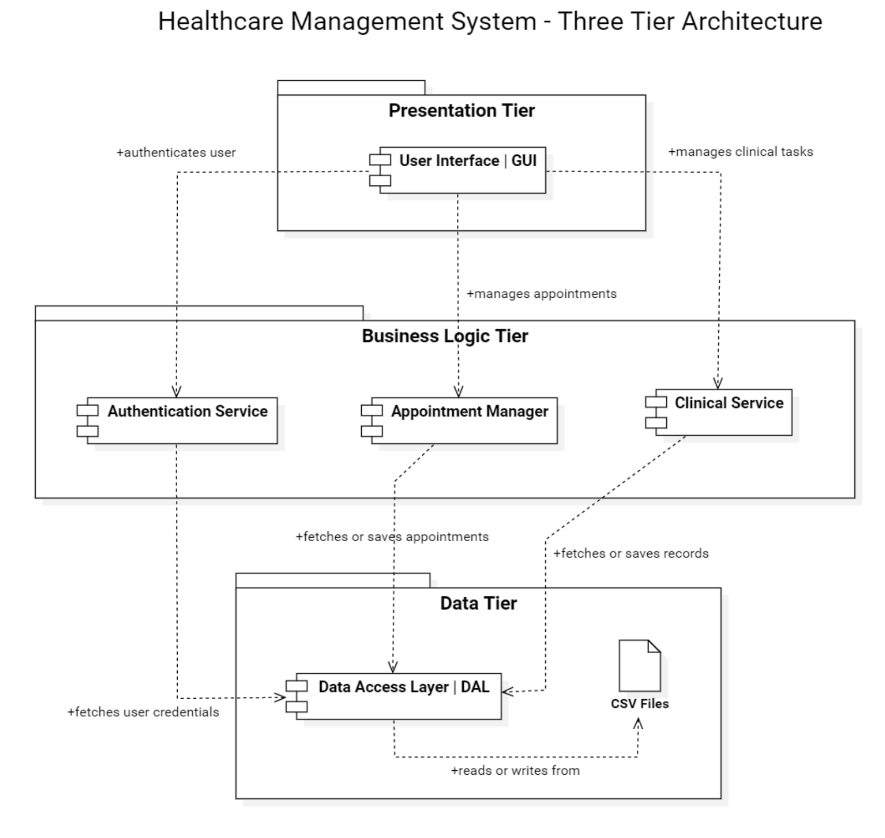
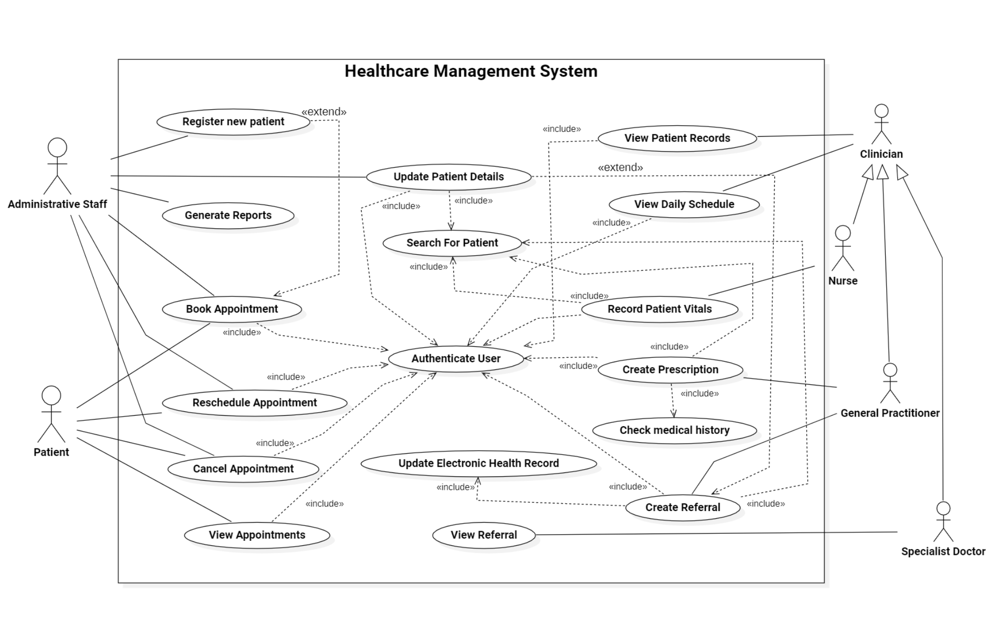
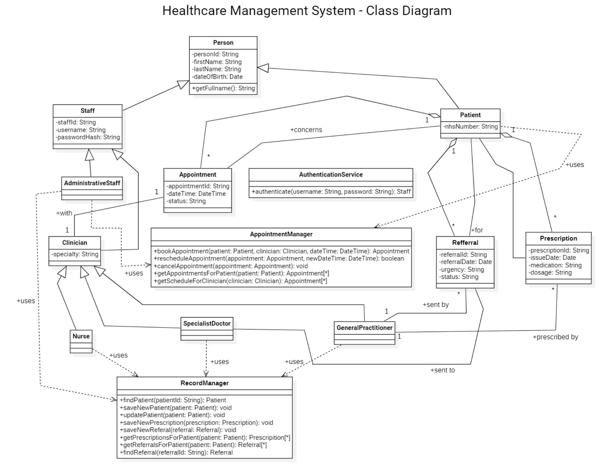

# 🏥 Healthcare Management System (Java)

A Java-based healthcare management system designed using MVC and a three-tier architecture.  
The system supports role-based access for patients, clinicians, and administrative staff, simulating real-world healthcare workflows.

---

## ✨ Features

- Role-based dashboards (Admin, Patient, Clinician)
- Appointment booking, rescheduling, and cancellation
- Patient record management
- Referral and prescription handling
- Vital signs recording (Nurse functionality)
- File-based persistent storage (CSV)

---

## 🧠 System Architecture

<p align="center">
  
</p>

The system follows a three-tier architecture:
- Presentation Layer (Swing UI)
- Business Logic Layer (Service classes)
- Data Layer (CSV-based storage)

---

## 📊 Design Diagrams

### Use Case Diagram
<p align="center">
  
</p>

### Class Diagram
<p align="center">
  
</p>

---

## 🏗 Design Approach

- MVC (Model-View-Controller)
- Object-Oriented Programming (OOP)
- Inheritance & Polymorphism
- Singleton pattern (Referral management)

---

## 🛠 Tech Stack

- Java  
- Swing (GUI)  
- MVC Architecture  
- Three-Tier Architecture  
- CSV-based storage  

---

## 📂 Project Structure

```text
src/
  controller/
  model/
  view/
  service/
  data/
